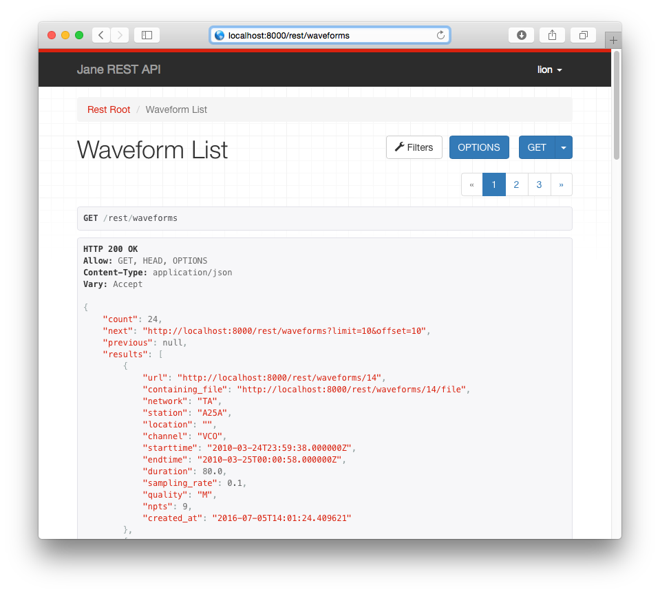

# Waveforms

`Jane`'s second pillar besides its plugin-based document database is the 
ability to deal with seismic waveforms. There is no reason to store that 
information in a document database as it is very well structured; something a 
relational database is made for.  Thus waveform data is stored in a couple of 
tables in the underlying PostgreSQL database.

## Indexing Waveforms

`Jane` does not store the waveform in the database but only indexes some 
information about it - thus **you must not move data after it has been 
indexed**, otherwise `Jane` will no longer be able to find it.

To index waveforms, use the `index_waveform` `manage.py` command. As all
`manage.py` commands, this has to be run from the `jane/src` directory. It 
is quite a powerful command and can recursively index a whole directory in a
single shot as well as continuously monitor a directory and automatically 
index all changed files.


#### Usage Examples

(1.) Run only once and remove duplicates::

```bash
DATA=/path/to/archive/2015,/path/to/archive/2016
LOG=/path/to/indexer.log
python manage.py index_waveforms --verbose -i0.0 --run-once \
    --check-duplicates -n1 -d$DATA
```

(2.) Run indexer as a daemon continuously crawling the given paths but index 
     only the last 24 hours (-r24) of a waveform archive::

```bash
DATA=/path/to/archive/2015,/path/to/archive/2016
LOG=/path/to/indexer.log
python manage.py index_waveforms --verbose -i0.0 -n1 -d$DATA -r24 -l$LOG &
```   


There are a lot more options, please refer to the `--help` output for the 
most up-to-date information.

```
$ python manage.py index_waveforms --help

usage: manage.py index_waveforms [-h] [--version] [-v {0,1,2,3}]
                                 [--settings SETTINGS]
                                 [--pythonpath PYTHONPATH] [--traceback]
                                 [--no-color] [-d DATA] [-n NUMBER_OF_CPUS]
                                 [-i POLL_INTERVAL] [-r RECENT] [-l LOG] [-a]
                                 [-1] [--check-duplicates] [--cleanup] [-f]
                                 [-H HOST] [-p PORT]

Crawl directories and index waveforms to Jane.

optional arguments:
  -h, --help            show this help message and exit
  --version             show program's version number and exit
  -v {0,1,2,3}, --verbosity {0,1,2,3}
                        Verbosity level; 0=minimal output, 1=normal output,
                        2=verbose output, 3=very verbose output
  --settings SETTINGS   The Python path to a settings module, e.g.
                        "myproject.settings.main". If this isn't provided, the
                        DJANGO_SETTINGS_MODULE environment variable will be
                        used.
  --pythonpath PYTHONPATH
                        A directory to add to the Python path, e.g.
                        "/home/djangoprojects/myproject".
  --traceback           Raise on CommandError exceptions
  --no-color            Don't colorize the command output.
  -d DATA, --data DATA  Path, search patterns and feature plug-ins of waveform
                        files. The indexer will crawl recursively through all
                        sub-directories within each given path. Multiple paths
                        have to be separated with a comma, e.g.
                        '/first/path=*.*,/second/path,/third/path=*.gse'. File
                        patterns are given as space-separated list of
                        wildcards after a equal sign, e.g. '/path=*.gse2
                        *.mseed,/second/path=*.*'. Default path option is
                        'data=*.*'.
  -n NUMBER_OF_CPUS     Number of CPUs used for the indexer.
  -i POLL_INTERVAL, --poll-interval POLL_INTERVAL
                        Poll interval for file crawler in seconds (default is
                        0).
  -r RECENT, --recent RECENT
                        Index only recent files modified within the given
                        number of hours. This option is deactivated by
                        default.
  -l LOG, --log LOG     Log file name. If no log file is given, stdout will be
                        used.
  -a, --all-files       The indexer will automatically skip paths or files
                        starting with a dot. This option forces parsing of all
                        paths and files.
  -1, --run-once        The indexer will parse through all given directories
                        only once and quit afterwards.
  --check-duplicates    Checks for duplicate entries within database. This
                        feature will slow down the indexer progress.
  --cleanup             Clean database from non-existing files or paths if
                        activated, but will skip all paths marked as archived
                        in the database.
  -f, --force-reindex   Reindex existing index entry for every crawled file.
  -H HOST, --host HOST  Server host name. Default is 'localhost'.
  -p PORT, --port PORT  Port number. If not given a free port will be picked.
```

## FDSN dataselect service

The most common way to retrieve waveforms from `Jane` will be via its fdsnws
`dataselect` service implementation. All indexed waveforms can be queried 
with it. It can be found at `JANE_ROOT/fdsnws/dataselect/1/` and used with 
any of the common tools.

A very convenient tool it the FDSN web service client of the
[ObsPy](http://obspy.org) library 
([documentation](http://docs.obspy.org/packages/obspy.clients.fdsn.html)), 
usage example with `Jane`:

```python
>>> import obspy
>>> from obspy.clients.fdsn import Client
>>> c = Client("http://JANE_ROOT")
>>> st = c.get.get_waveforms(
...     network="BW", station="RJOB", location="", channel="BHZ", 
...     starttime=obspy.UTCDateTime(2016, 1, 1, 3, 0, 5),
...     endtime=obspy.UTCDateTime(2016, 1, 1, 5, 0, 5))
```

## Waveform REST Interface

Waveforms can also be retrieved via the REST interface, found at 
`JANE_ROOT/rest/waveforms`. In most cases the fdsnws service will be more 
convenient but the REST interface exists if somebody needs it. It should be 
fairly self-explanatory.




## Restrictions/Protected Stations

By default all waveform data is public, i.e. anybody with access to the `Jane`
HTTP server can query all data. It is possible to limit access at a 
per-station granularity. To do that, add a new restriction in the admin 
interface. As soon as a restriction has been added it will be considered 
protected and only users that are part of the restriction will still be able
to access them.


To access the data, users will have to use the `queryauth` route of the 
fdsnws `dataselect` service. Usage example with `ObsPy`:


```python
>>> import obspy
>>> from obspy.clients.fdsn import Client
>>> c = Client("http://JANE_ROOT", user="lion", password="myfavoritepw")
>>> st = c.get.get_waveforms(
...     network="BW", station="RJOB", location="", channel="BHZ", 
...     starttime=obspy.UTCDateTime(2016, 1, 1, 3, 0, 5),
...     endtime=obspy.UTCDateTime(2016, 1, 1, 5, 0, 5))
```
